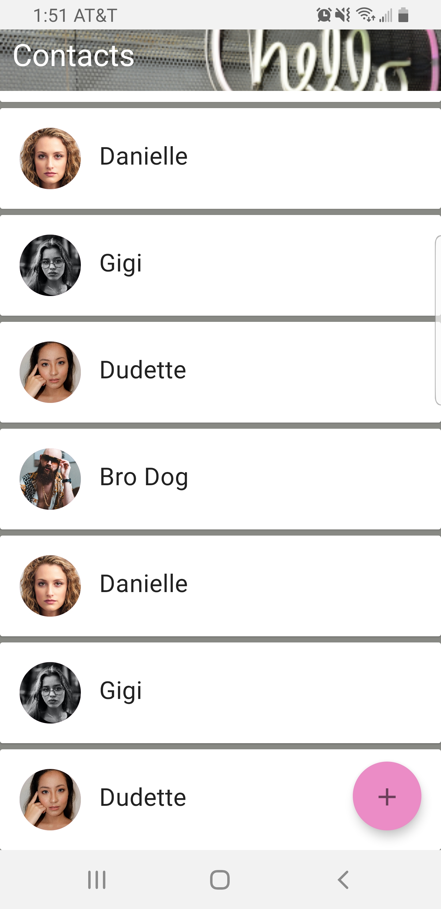
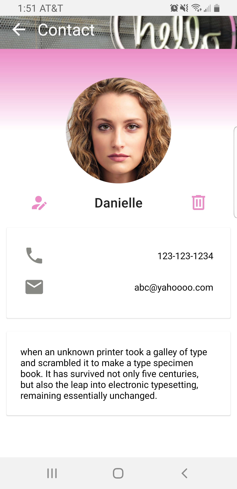
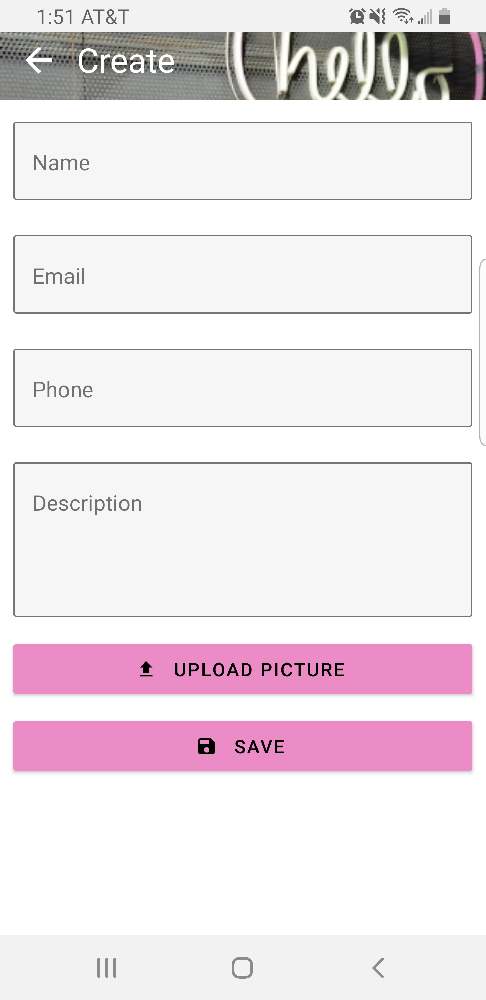

<h1 style="text-align:center">Hello Contacts</h1>

  
  
  

A Sample Expo project using React Native 0.62. Leverages multiple commonly used libraries such as React Navigation and react-native-paper.

## Develop
1. `git clone https://github.com/rowlinsonmike/hello-contacts.git`
2. `expo start` inside repo directory

